<h2 align="center">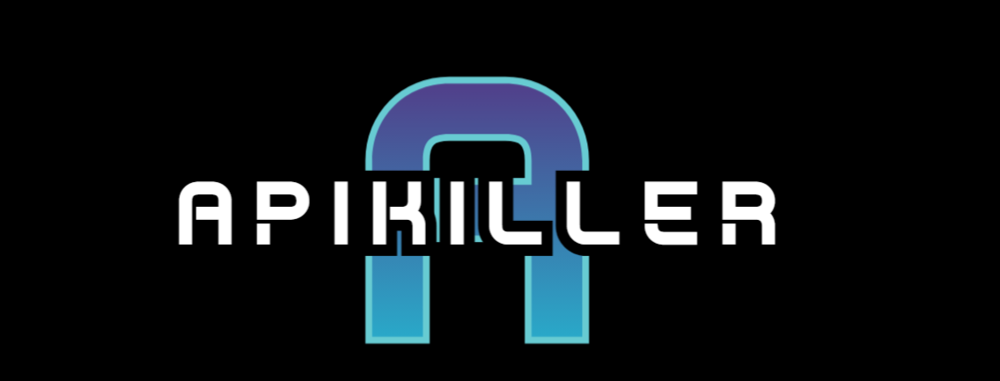<br/><br/>
APIKiller-企业API安全保护神</h2>
<p align="center">
  <a href="#项目简介">简介</a> •
  <a href="#项目架构">架构</a> •
  <a href="#Feature">Feature</a> •
  <a href="#食用宝典">食用宝典</a> •
  <a href="#二次开发文档">二次开发文档</a> •
  <a href="#更新记录">更新</a> •
  <a href="#项目社区">项目社区</a> •
  <a href="#致谢">致谢</a>
</p><br/>


## 项目简介
**一款高度可定制化的DAST&API Security平台**

详细参考： [快看~项目精髓](https://aur0ra.cn/3-apikiller/)

## 项目架构

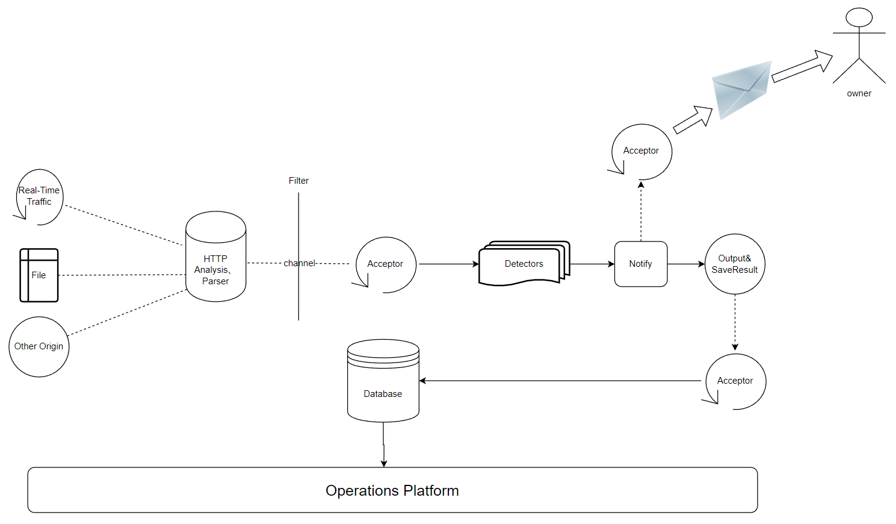


## Feature
- 支持HTTP/HTTPS流量检测
- 多来源检测
  - 支持流量监听
  - 支持历史流量回扫\[目前只支持burpsuite存储流量\]
- 多功能扫描模块
  - 越权检测模块，高效精准，支持多情景检测
  - 40x bypass 模块
  - csrf 检测模块
  - open-redirect 检测模块
  - Dos检测模块【谨慎配置，避免出现大量脏数据】
  - 【欢迎大家积极提PR】
- 多功能Filter处理，默认自带多个filter
  - 针对性扫描，例如只对 baidu.com域名进行扫描
  - 去重扫描，提高效率
  - 自动过滤静态文件(js,gif,jpg,png,css,jpeg,xml,img,svg...)
- API 运维
  - 提供简易的API Security运维平台
- 多方式漏洞发现提醒
  - Lark飞书
  - 钉钉
  - ...
- 对抗常见风控手段
  - 频控
- **【重磅】以上都可以快速进行二次开发**

## 食用宝典
1. 安装好数据库环境（我个人采用的是docker）
   1. docker pull 数据库镜像
   ```shell
    sudo docker run --name mysql-server -e MYSQL_ROOT_PASSWORD=123456 -p 3306:3306  mysql:5.7
   ```
   2. 导入apikiller.sql文件
   ```shell
    sudo docker cp /tmp/apikiller.sql bteye-mysql:/tmp/apikiller.sql
   ```
   3. 登入mysql
   ```shell
    docker exec -it mysql-server mysql -uroot -p123456
    source /tmp/apikiller.sql
   ```
   4. 【重点】在 config.yaml 中进行相关配置
   
        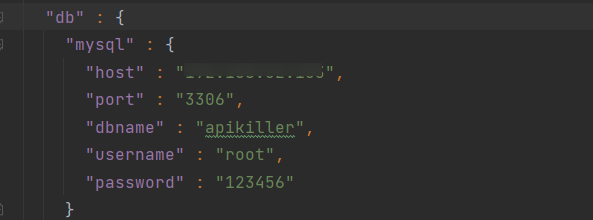

2. 安装根目录下的https证书[windows环境]
   1. 找到根目录下的ca.crt证书
   
        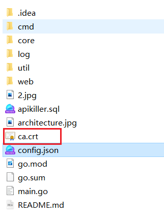
   
   2. 点击安装即可，将其添加到系统根信任证书颁发位置

   3. 配置漏洞发现通知Webhook
      1. 根据[飞书指导](https://open.feishu.cn/document/ukTMukTMukTM/ucTM5YjL3ETO24yNxkjN)，开启一个bot，并复制相关的webhook【支持secret鉴权操作】

      2. 在根路径下的config.json中进行配置(如果有secret，就进行配置)
      
            

     

   3. 配置成功后，当发现漏洞时，会立即推送漏洞信息

       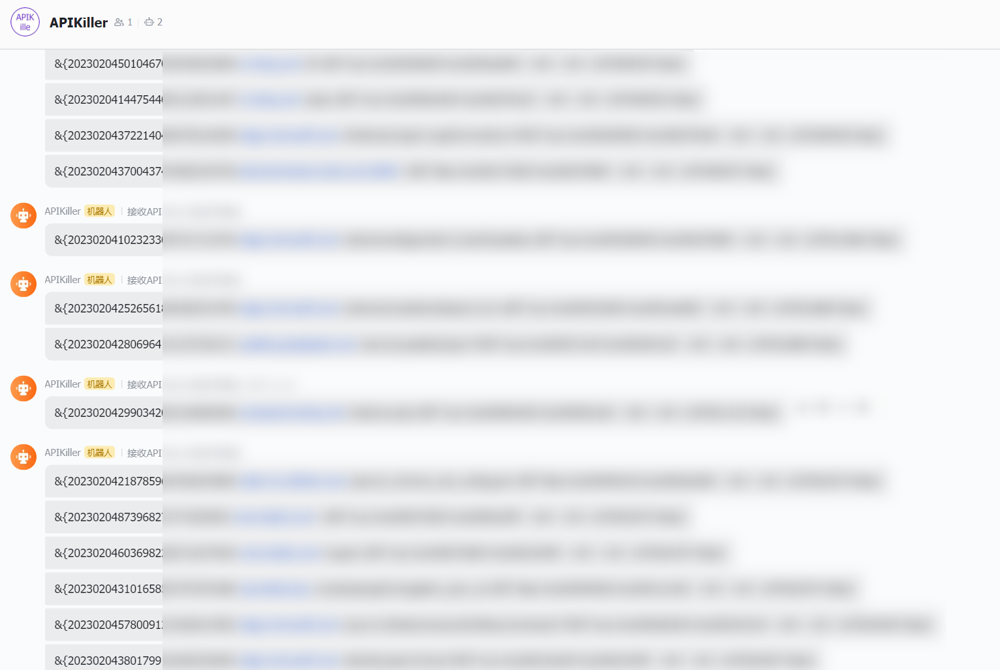

     

3. 一键启动【所有的配置都在config.yaml】

    

    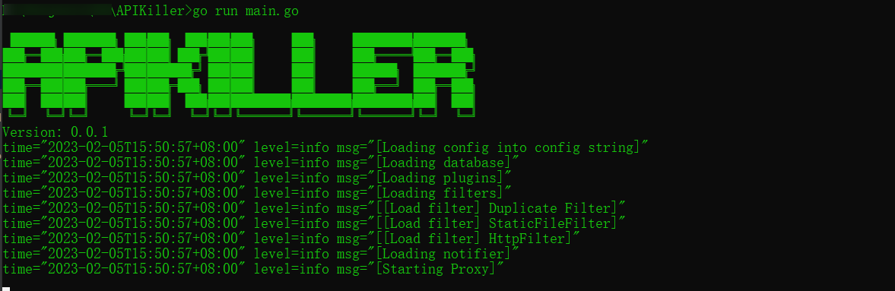

4. **ding~，发现新漏洞，快去看鸭**

5. 漏洞运营，及时对漏洞进行研判和修复

     

  


> **基本配置：数据库模块、过滤器模块、通知模块**
> 
> **除基本配置外，还必须进行如下的模块配置。（其中的option必须配置为1，才代表启动该模块）**
### API越权检测
> 这里基于[VAPI越权靶场](https://www.freebuf.com/vuls/332312.html) 进行实战模拟
> 配好环境后，先根据项目鉴权机制，提供另一个不同权限的账号，配置好config.yaml
1. 根据企业开发规范，配置好越权模块的相关配置

    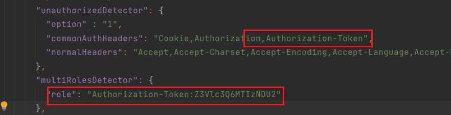
2. 启动项目，访问接口<br/>
    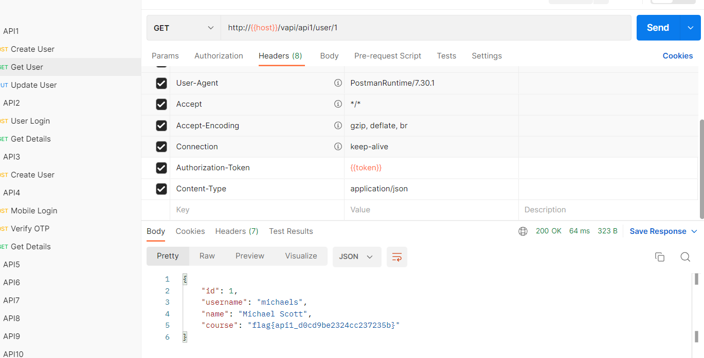<br/>
    

3. **成功检测出越权和csrf**

    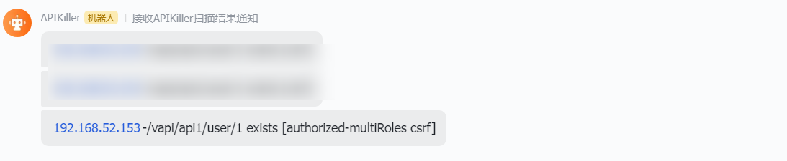

### 403 bypass模块
> 当前可以进行大小写、path fuzz、api版本降级等方式，来进行探测

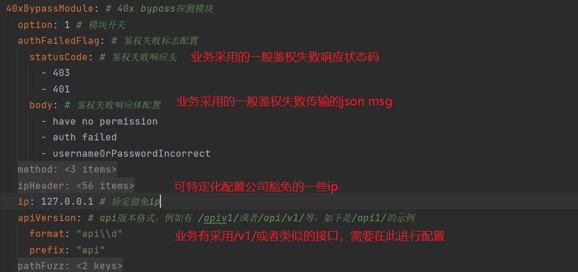<br/>
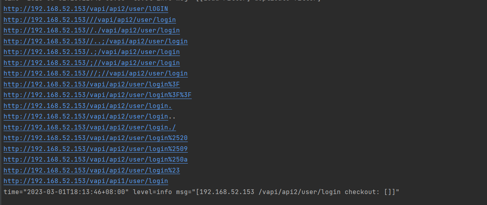


### CSRF检测
> 基于pikachu靶场，进行漏洞检测


处理csrf模块的配置<br/>
    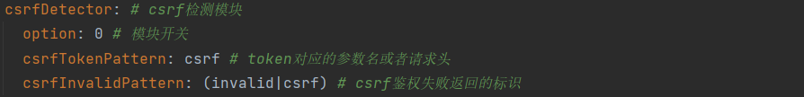
    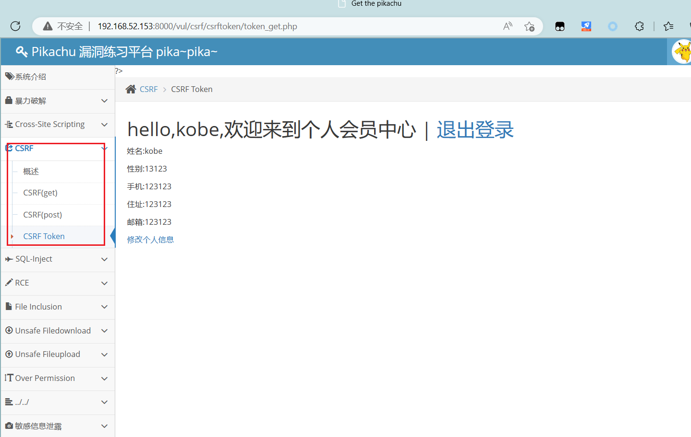	
    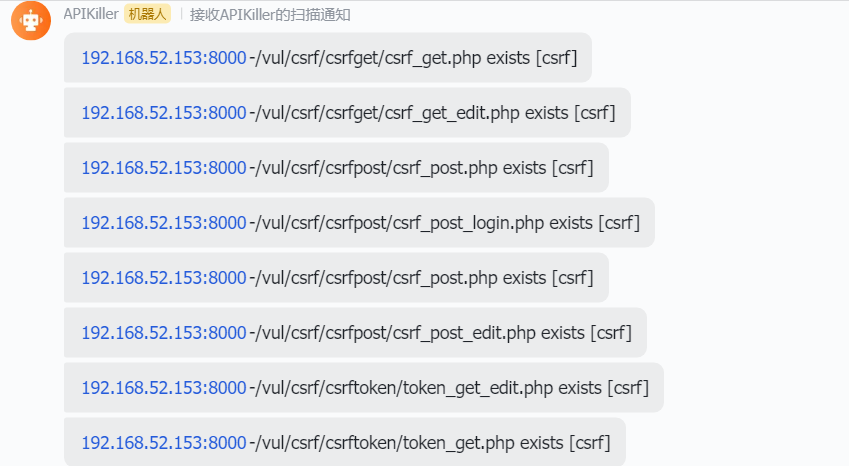	


## HTTP HOOK机制
> 为避免扫描时造成过无效流量，可以通过提供的HTTP HOOK机制，对请求流量自定义修改，例如添加header，来区分测试流量和实际流量

【注意】当前由于golang plugin机制特性，暂不支持windows下的流量修改

1. HTTP HOOK 样例
```go
package main

import (
	"fmt"
	"net/http"
)

type RequestHook interface {
	HookBefore(*http.Request) // hook before initiating http request
	HookAfter(*http.Request)  // hook after finishing http request
}

type AddHeaderHook struct {
}

func (a AddHeaderHook) HookBefore(request *http.Request) {
	fmt.Println("HOOK Before: hhhhhhh")
	// ....
}

func (a AddHeaderHook) HookAfter(request *http.Request) {

}

// Hook this is exported, and this name must be set Hook
var Hook AddHeaderHook
```

【严格按照上面的代码规范，其中最后一行代码，命名必须设置为Hook】

2. 生成对应的so链接库
```shell
go build -buildmode=plugin APIKillerHookSample.go
```

```shell
$ ls
APIKillerHookSample.go  APIKillerHookSample.so  go.mod
```
3. 将生成的so放置到项目的hooks目录下
```shell
$ ls ./hooks
APIKillerHookSample.so
```
4. 启动项目即可完成流量更改


## 二次开发文档
【暂无】

## 更新记录
### v0.0.2
- 【功能】修正对https请求的处理
- 【功能】优化csrf检测模块
- 【功能】添加对钉钉通知的支持
- 【优化】对整体架构进行优化，提高效率（通知模块优化、数据库存储模块优化）
- 【优化】重改数据库设计，同时数据库存储时进行base64转码操作


### v0.0.3
- 【功能】新增40xbypass模块，支持常见架构层绕过和接口层绕过
- 【优化】优化权限检测模块，向甲方实际情况靠齐
- 【优化】调整配置解析，从json迁移至yaml，同时优化全局解析过程，提高检测效率
- 【优化】调整filter顺序，同时对duplicationFilter查询过程由数据库查询到成员变量查询
- 【bugFix】修复线程安全导致的数据重复等问题
- 【bugFix】调整全局的chance-recovery 机制为clone机制

### v0.0.4
- 【功能】添加HTTP HOOK功能，可满足区分测试产生的http脏数据、流量清洗功能。[具体使用方式](#HTTP HOOK机制)
- 【功能】新增开放重定向检测模块，支持对常见的GET Query方式进行测试
- 【功能】新增DoS安全测试模块，目前可以对查询资源大小未控制导致的DoS进行检测，例如size设置为超大数
- 【优化】针对之前试用时产生的各种不适进行了一个优化

## 项目社区


## 致谢
【**最后感谢项目中所使用到的各种开源组件的作者**】
