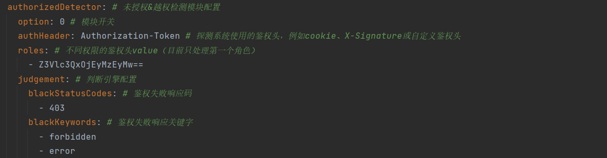

# APIKIller


## 项目简介
**一款高度可定制化的DAST&API Security平台**

详细参考： [快看~项目精髓](https://aur0ra.cn/3-apikiller/)


## Feature
- 支持HTTP/HTTPS流量检测
- 多来源检测
  - 支持流量监听
  - 支持历史流量回扫\[目前只支持burpsuite存储流量\]
- 多功能扫描模块
  - 越权检测模块，高效精准，支持多情景检测
    - 具备多种鉴权姿势的账号设定
    - 多维度、特征化判断引擎
  - 40x bypass 模块
    - 支持常见的架构层的解析不一致导致的风险检测
    - 支持常见后门检测
  - csrf检测模块
    - 支持token检测
    - 常见的referer、origin检测
  - 【欢迎大家积极提PR】
- 多功能Filter处理，默认自带多个filter
  - 针对性扫描，例如只对 baidu.com域名进行扫描
  - 去重扫描，提高效率
  - 自动过滤静态文件(js,gif,jpg,png,css,jpeg,xml,img,svg...)
- API 运维
  - 提供简易的API Security运维平台
- 多方式漏洞发现提醒
  - Lark飞书
  - 钉钉
  - ...
- 对抗常见风控手段
  - 频控
- **【重磅】以上都可以快速进行拓展&二次开发**

## 食用宝典
1. 安装好数据库环境（我个人采用的是docker）
   1. docker pull 数据库镜像
   ```shell
    sudo docker run --name mysql-server -e MYSQL_ROOT_PASSWORD=123456 -p 3306:3306  mysql:5.7
   ```
   2. 导入apikiller.sql文件
   ```shell
    sudo docker cp /tmp/apikiller.sql bteye-mysql:/tmp/apikiller.sql
   ```
   3. 登入mysql
   ```shell
    docker exec -it mysql-server mysql -uroot -p123456
    source /tmp/apikiller.sql
   ```
   4. 【重点】在 config.yaml 中进行相关配置
   
   
2. 安装根目录下的https证书[windows环境]
   1. 找到根目录下的ca.crt证书  
   
   2. 点击安装即可，将其添加到系统根信任证书颁发位置
3. 配置漏洞发现通知Webhook
   1. 根据[飞书指导](https://open.feishu.cn/document/ukTMukTMukTM/ucTM5YjL3ETO24yNxkjN)，开启一个bot，并复制相关的webhook【支持secret鉴权操作】
   2. 在根路径下的config.json中进行配置(如果有secret，就进行配置)
   
   3. 配置成功后，当发现漏洞时，会立即推送漏洞信息
   
4. 一键启动【所有的配置都在config.json】

    
    
5. ding~，发现新漏洞，快去看鸭

## 必要配置&检测效果展示
> 基本配置：数据库模块、过滤器模块、通知模块
> 
> 除基本配置外，还**必须**进行如下的模块配置。（其中的option必须配置为1，才代表启动该模块）
>
### API越权检测
>这里基于[VAPI越权靶场](https://www.freebuf.com/vuls/332312.html) 进行实战模拟
配好环境后，先根据项目鉴权机制，提供另一个不同权限的账号，配置好config.yaml
> 
1. 根据企业开发规范，配置好越权模块的相关配置

然后启动项目，访问接口


**成功检测出越权和csrf**


### 403 bypass模块
> 当前可以进行大小写、path fuzz、api版本降级等方式，来进行探测


### CSRF检测
> 基于pikachu靶场，进行漏洞检测

处理csrf模块的配置


## 项目架构


## API运营平台


## 二次开发文档
【暂无】

## 更新记录（功能、优化、bugFix）
### v0.0.2
- 【功能】修正对https请求的处理
- 【功能】优化csrf检测模块
- 【功能】添加对钉钉通知的支持
- 【优化】对整体架构进行优化，提高效率（通知模块优化、数据库存储模块优化）
- 【优化】重改数据库设计，同时数据库存储时进行base64转码操作


### v0.0.3
- 【功能】新增40xbypass模块，支持常见架构层绕过和接口层绕过
- 【优化】优化权限检测模块，向甲方实际情况靠齐
- 【优化】调整配置解析，从json迁移至yaml，同时优化全局解析过程，提高检测效率
- 【优化】调整filter顺序，同时对duplicationFilter查询过程由数据库查询到成员变量查询
- 【bugFix】修复线程安全导致的数据重复等问题
- 【bugFix】调整全局的chance-recovery 机制为clone机制


## 后期计划
- [x] 403bypass module
- [x] 完善其他通知方式的支持
- [ ] 添加csrf bypass 模块
- [ ] 支持扫描代理功能
- [ ] 提供docker版快速搭建能力
- [ ] 添加ssrf和open redirect检测
- [ ] 完成二次开发文档介绍
- [ ] 其他

## 感谢
【**最后感谢项目中所使用到的各种开源组件的作者**】
=======

>>>>>>> APIKiller v0.0.3
